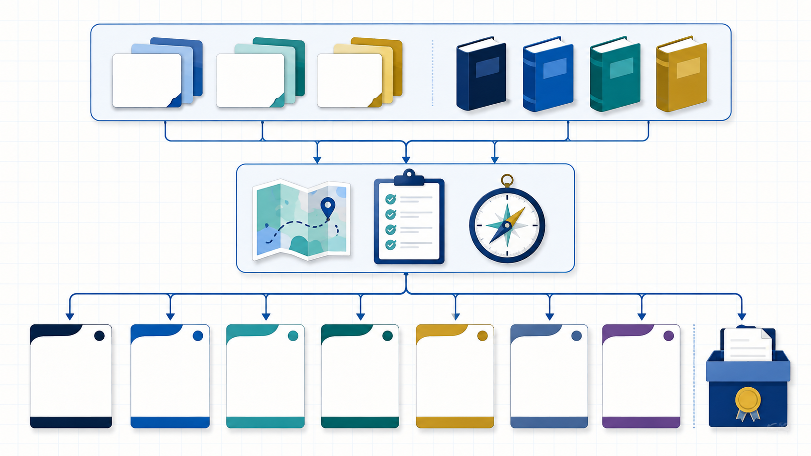

# SCI-Writingskill

*English version. 中文版见 [README.md](README.md).*


An agent skill for writing English journal (SCI) manuscripts, loadable by Claude Code, Codex and other agents that read `SKILL.md` files. It covers structural templates for title, abstract, introduction, methods, results, discussion and conclusion; tense, voice and verb conventions for academic English; paragraph-logic models; a sentence-level checklist of errors typical of Chinese authors; ethics and declaration wording; and a pre-submission checklist, journal selection, cover letters and responses to reviewers.

The content is a study-notes style rewrite based on two print writing textbooks held by the maintainer (see “Copyright” below). It has been through four batches of review and a regression suite of seven samples (Methods, Introduction, Abstract, Results, Discussion, Title, Response to reviewers), each also run against a no-skill baseline. The rules the skill adds value on, measured against that baseline, are: never inventing facts or citations, keeping abstract length and closing sentences in shape, explaining what each citation placeholder should cite, letter-format discipline, and an explicit self-check.

All instructional text is in Simplified Chinese; the English templates, phrase banks and example sentences are in English. The skill works for any user, but its explanations will read in Chinese.

## Architecture: from notes to a callable skill



The repository keeps traceable Chinese study notes, `SKILL.md` routing, and focused `references/` separate. An agent selects the rules for the task first, then applies them to manuscript sections or submission materials. The visual is an overview; the file map below is authoritative.

## Workflow: from evidence to submission


1. Storyline → 2. Tension statement → 3. Subheadings → 4. Section drafting → 5. Paragraph logic → 6. Sentences and verbs → 7. Style and sentence scan → 8. Self-check and submission. See [`references/00-workflow.md`](skills/sci-writing/references/00-workflow.md) for entry points and deliverables.

## Install

The skill itself is the `skills/sci-writing/` directory (`SKILL.md` + `references/` + `samples/`). Pick any one line below.

### One-line install

**npx (recommended; installs into every agent detected on the machine, e.g. Claude Code, Codex, Cursor)**

```bash
npx skills add Zenine/SCI-Writingskill -g -y
```

Uses the open-source `skills` CLI (skills.sh). Drop `-g` to install into the current project only; `--copy` copies instead of symlinking; `npx skills update` pulls updates later.

**curl (no Node needed; installs into existing `~/.claude` and `~/.codex`)**

```bash
curl -fsSL https://raw.githubusercontent.com/Zenine/SCI-Writingskill/main/scripts/install.sh | bash
```

To inspect the script first:

```bash
curl -fsSL https://raw.githubusercontent.com/Zenine/SCI-Writingskill/main/scripts/install.sh -o install.sh
less install.sh && bash install.sh
```

Options: `bash install.sh --link` clones into `~/.local/share/sci-writing` and symlinks, so `git pull` updates it; `TARGET=claude` or `TARGET=codex` installs into one agent only; `DEST=<dir>` sets a custom location; `REF=<tag>` installs a specific version. The script only downloads, copies or symlinks; it does not touch any configuration file.

**Claude Code plugin (marketplace)**

```bash
claude plugin marketplace add Zenine/SCI-Writingskill && claude plugin install sci-writing@sci-writingskill
```

Update later with `claude plugin marketplace update sci-writingskill`.

**Or just tell your agent**

> Install the `skills/sci-writing` directory from https://github.com/Zenine/SCI-Writingskill into my skills directory (`~/.claude/skills/` for Claude Code, `~/.codex/skills/` for Codex).

### Manual install

```bash
git clone https://github.com/Zenine/SCI-Writingskill.git
cp -r SCI-Writingskill/skills/sci-writing ~/.claude/skills/sci-writing        # Claude Code, user level
cp -r SCI-Writingskill/skills/sci-writing <project>/.claude/skills/sci-writing # one project only
cp -r SCI-Writingskill/skills/sci-writing ~/.codex/skills/sci-writing         # Codex
```

Any other agent that can read files: load `skills/sci-writing/SKILL.md` as the system prompt or first instruction; its routing table tells the agent which `references/*.md` to read.

### Verify

Start a new session and ask, for example, "turn this Chinese methods paragraph into an English Methods section" or "check this paragraph for Chinglish". The agent should first restate the storyline and list the functional steps of that section, then produce the English text and a self-check. To run the full regression, follow `skills/sci-writing/samples/README.md` with any input under `samples/`.

## How it works

`SKILL.md` is the entry point. The agent uses its routing table to pick the reference file for the task, then follows that file's structure, templates, common errors and self-check list. Every writing output has the same seven parts: understanding check → structure → text → change notes → self-check → suggested additions → hand-off notes. Ten hard rules apply in every scenario; the core ones are: structure before sentences, never invent facts, never invent references (use `[REF]` placeholders and say what should be cited), ownership must be recognisable, one hedge per sentence, consistent terminology, target journal first, American spelling by default, and no blocking when the user asks for direct output.

| File | Content |
|---|---|
| `references/00-workflow.md` | Eight-step workflow from storyline to submission, with an entry-point table |
| `references/01-introduction.md` … `04-discussion-conclusion.md` | Functional-step models and templates for introduction, methods, results, discussion/conclusion |
| `references/05-abstract.md`, `06-title-keywords.md` | Abstract (general / structured / Nature style, highlights), title, keywords, subheadings |
| `references/07-paragraph-logic.md` | Four paragraph-logic models, connector groups, sentence linking |
| `references/08-verbs-tense-voice.md` | Tense/voice master table by section (including letters), certainty ladder, hidden-action patterns |
| `references/09-academic-style.md`, `09a-metrics-table.md` | Academic style; the single source of sentence/paragraph length and word-count conventions |
| `references/10-chinese-author-pitfalls.md` | Sentence-level checklist of errors typical of Chinese authors (error / warning tiers, detection signals, false-positive table) |
| `references/11-ethics-and-readers.md` | Ethics and declaration wording, reader awareness, the four storyline questions |
| `references/12-submission-checklist.md` | 104-item pre-submission checklist, journal selection, cover letter, response-letter structure |
| `samples/` | Regression inputs and expected points (seven samples from one running example paper) |

## Repository layout

- `skills/sci-writing/` — the deliverable.
- `notes/` — Chinese study notes based on two print reference books (second-order rewrites), kept for traceability.
- `docs/plans/`, `docs/reviews/`, `docs/decisions/` — implementation plan, review reports, unified rulings, and the book-divergence log.
- `tests/regression/` — regression outputs and gradings, plus the no-skill baseline runs and the delta analysis.
- `scripts/verify.sh` — verification entry: restricted reference materials are not tracked; SKILL.md and references are cross-referenced; source annotations and public-privacy risks are checked.
- `.claude-plugin/` — Claude Code plugin and marketplace manifests.
- `assets/` — README hero, architecture, and workflow images; product documentation only, with no restricted reference material.

## License and copyright

This repository uses directory-scoped dual licensing: code and configuration such as `scripts/`, `.github/`, `tests/`, and `.claude-plugin/` are under the [MIT License](LICENSES/MIT.txt); `skills/`, `notes/`, `docs/`, this README, and `assets/` are under [CC BY 4.0](LICENSES/CC-BY-4.0.txt). See the root [LICENSE](LICENSE) for the complete directory boundaries and exclusions.

The two print reference books and any copyrighted material from them are outside this repository's license and are not included in this repository.

## Copyright approach

This skill is a study-notes style rewrite based on two print reference books held by the maintainer. Methodology, structural models and checklists are rewritten in our own words; the English content collects only generic academic phrases, regrouped, and every example sentence is original. The repository neither includes nor distributes any material from the reference books.
